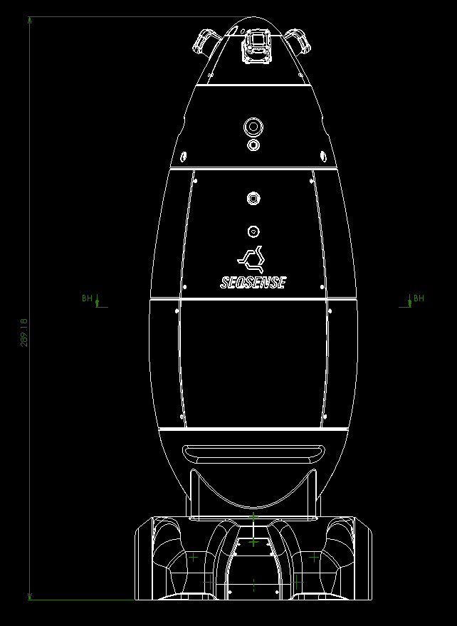
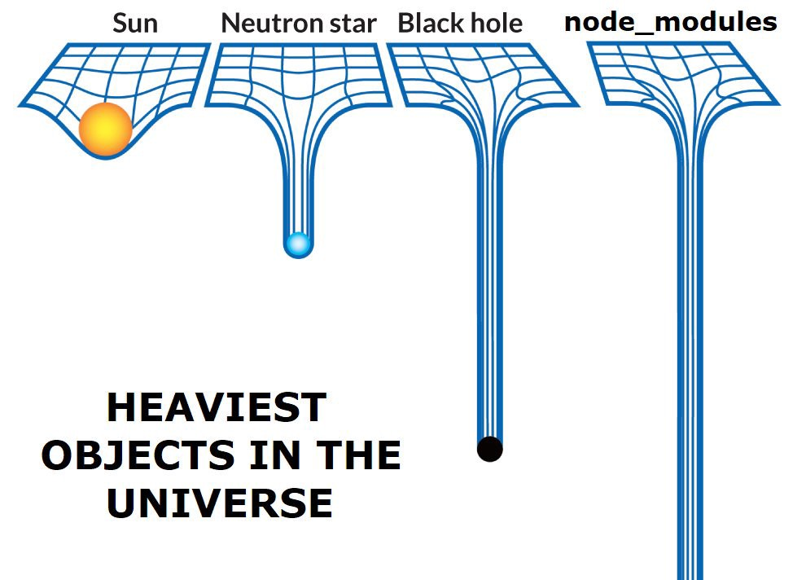

class: middle, center


# Deno (での) の話

---

class: middle, center

# 🦕 Deno 聞いたことある人
# 🙋‍♀️ 🙋‍♂️

---

class: middle, center

# 🦕 Deno 使ったことある人
# 🙋‍♀️ 🙋‍♂️

---
class: middle, center


# Deno (での) の話

---
class: center
自己紹介: 日野澤 (ひのさわ)

# kt3k (twitter, github, ...)

フリーランスのフロントエンドエンジニア<br />
今はロボットスタートアップ SEQSENSE 勤務<br />
(TS, Go, ROS できる人募集中! オフィス: 日比谷)





---

# Deno (での) とは

- 2018年6月に発表された JavaScriptと**TypeScript** の実行環境
  - Node.js みたいなもの (サーバーサイド JS)
  - 作者は Node.js の作者 ライアン・ダール
  - 作者独自の視点で Node を改良したもの

<p style="text-align: center">

</p>

---
class: middle, center

# Node.js との違い

---
class: middle

# Node.js との違い

- require vs import
- Security
- TypeScript
- 実装について
- 標準ライブラリについて

---
class: middle, center

# require と import が違う


---
# import

- Node は import を現在実装中
  - .mjs 拡張子, package.json の type: 'module' などのメタ情報で module vs script の区別をしようとしている.
  - => なかなかリリースされない, ブラウザ非互換
  - transpiler の import はまた別の仕様 => 非常に複雑
- Node の import はかなり複雑

---
# import

- Deno は import (ES Module) しか無い.
- npm が使えないというデメリットはあるものの, ブラウザ互換の import なので, ブラウザ向けモジュールをそのまま使える 例: date-fns
- 良いところ:
  - cjs <-> mjs 相互運用を考えなくてよい.
  - 会社としての npm inc. への依存がない.

---
# import

- Deno はブラウザ互換の import を持っているので, date-fns の es module エンドポイントを直接使うことができる. (URL を直接 import できる)

```js
import {
  parseDate
} from 'https://deno.land/x/date-fns/index.js'

console.log(toDate('2014-02-11T11:30:30'))
//=> Tue Feb 11 2014 11:30:30
```

---
class: middle, center

# Security

---
# Deno の Security

- Deno は Node.js と同様に V8 ベース
- V8 = ブラウザの JS エンジン
  - サンドボックス環境になっている
  - => V8 の中のプログラムが容易に外部のプログラムやファイルにアクセスできないような仕組みになっている

---
# Deno の Security

- Node では素朴に OS の機能にアクセスする Native 拡張を V8 に入れた.
  - => サンドボックスではなくなった
  - => セキュリティインシデントの顕在化 (event-stream 事件 eslint-scope 事件, etc)

---
# Deno の Security
- Deno は V8 のサンドボックス機能を活用
  - => コンピュータのリソースにアクセスする際には全て許可制 ex. read, write, net, env, etc
  - => 意図しない不正操作をされにくくなった

---
# Deno の Security

```
deno --allow-read foo.ts
```

↑ Read しかできないプログラム実行例

- foo.ts の依存ライブラリに攻撃コードが含まれていたとしても foo.ts は絶対にネットワークアクセスすることは出来ない. => eslint-scope 事件のようなインシデントがそもそも成立しない

---
class: middle, center
# TypeScript

---
# Node の TypeScript

- Node の世界では TypeScript はあくまで Opt in
  - @types モジュールはあったり無かったり
  - @types があってもバグっていたり
  - npm のバージョンがあがったけど @types が更新されないので使えなかったり

TypeScript が opt-in であることによる弊害がいろいろある

---
# TypeScript opt-in の弊害

- 同僚に全部 any にされる
- any は嘘 => 炎上

---
class: middle, center
最初から全部 TypeScript で出来ていればよかったのに・・・

---
# Deno の TypeScript

- Deno は処理系に TypeScript が入っている.
  - 標準ライブラリも全て TypeScript で書かれている.
  - 根っこから全てに型が入った状態
  - 現状のエコシステムはまだまだ小さいが, 今後も全て TypeScript で実装されていきそうな見込み.

---
class: middle, center
# 実装の違い

---
# Node
- C++, 生JavaScript

# Deno
- Rust, TypeScript

---
# Node
- C++, 生JavaScript

# Deno
- Rust, TypeScript (優勝 🎉)

---
class: middle, center
# 言語のカバー範囲に対する
# 考え方の違い

---
# Node

- スモールコアという考え方
- Node 自体は本当に最小限の機能しか実装しない
- 他の全ての機能は npm に委譲する
  - left-pad みたいなマイクロライブラリが大量発生
  - => 良いところと悪いところがある

---
# Node スモールコア

- 良い点
  - 標準機能が無いので, 誰かが標準機能を作る
  - 標準機能が進化していく
  - jslint -> jshint -> eslint 🎉
  - superagent -> axios -> ky

---
class: middle
# Node スモールコア
- 悪い点
  - 標準機能 / 小さな機能の乱立
  - 依存関係が深くなる
  - 依存の全体が巨大になりがち => 時間が経って特に巨大さが顕著になってきた



---
# Python

- Batteries Included という考え方
- => 翻訳すると「電池入ってる」
- 基本的なことはだいたい標準ライブラリで出来るようになっている

---
# Deno の標準ライブラリ

- Deno は Node とは違い Batteries Included 志向
- Deno の標準ライブラリは Go 言語の標準ライブラリのカバー範囲をカバーすることを目指している.
  - => マイクロモジュールの乱立を防ぐ効果が期待できる

=> No more 巨大依存!!

---
# まとめ

- Deno は import が綺麗
- Deno は Security がすごい
- Deno は TypeScript 入ってる
- Deno は実装が良い
- Deno は大きい標準ライブラリ志向

---
class: middle, center


ご清聴ありがとうございました! 
